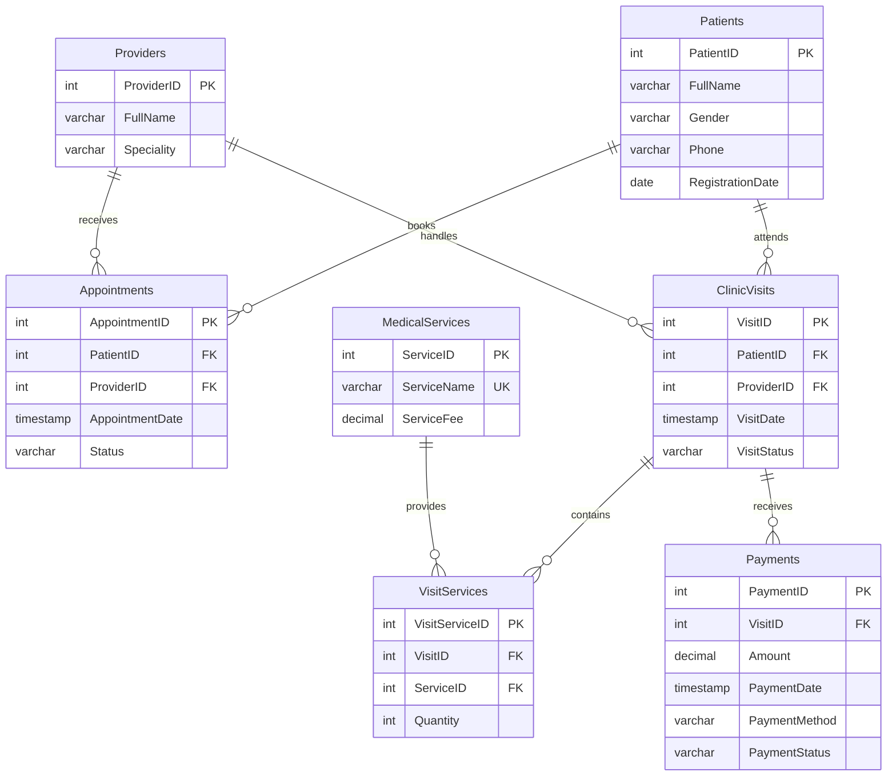

```mermaid
erDiagram
    Patients ||--o{ Appointments : books
    Providers ||--o{ Appointments : receives
    Patients ||--o{ ClinicVisits : attends
    Providers ||--o{ ClinicVisits : handles
    ClinicVisits ||--o{ VisitServices : contains
    MedicalServices ||--o{ VisitServices : provides
    ClinicVisits ||--o{ Payments : receives

    Patients {
        int PatientID PK
        varchar FullName
        varchar Gender
        varchar Phone
        date RegistrationDate
    }

    Providers {
        int ProviderID PK
        varchar FullName
        varchar Speciality
    }

    Appointments {
        int AppointmentID PK
        int PatientID FK
        int ProviderID FK
        timestamp AppointmentDate
        varchar Status
    }

    ClinicVisits {
        int VisitID PK
        int PatientID FK
        int ProviderID FK
        timestamp VisitDate
        varchar VisitStatus
    }

    MedicalServices {
        int ServiceID PK
        varchar ServiceName UK
        decimal ServiceFee
    }

    VisitServices {
        int VisitServiceID PK
        int VisitID FK
        int ServiceID FK
        int Quantity
    }

    Payments {
        int PaymentID PK
        int VisitID FK
        decimal Amount
        timestamp PaymentDate
        varchar PaymentMethod
        varchar PaymentStatus
    }
```